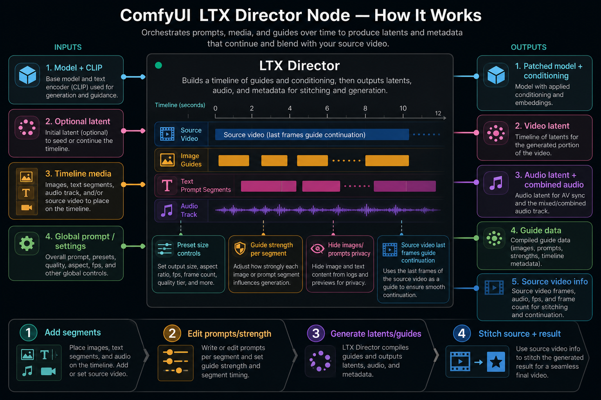
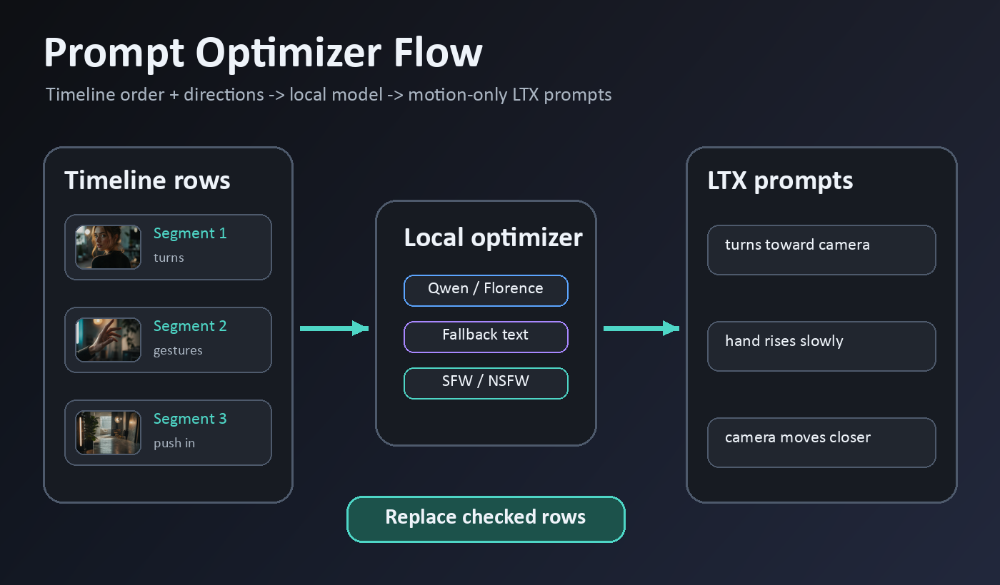
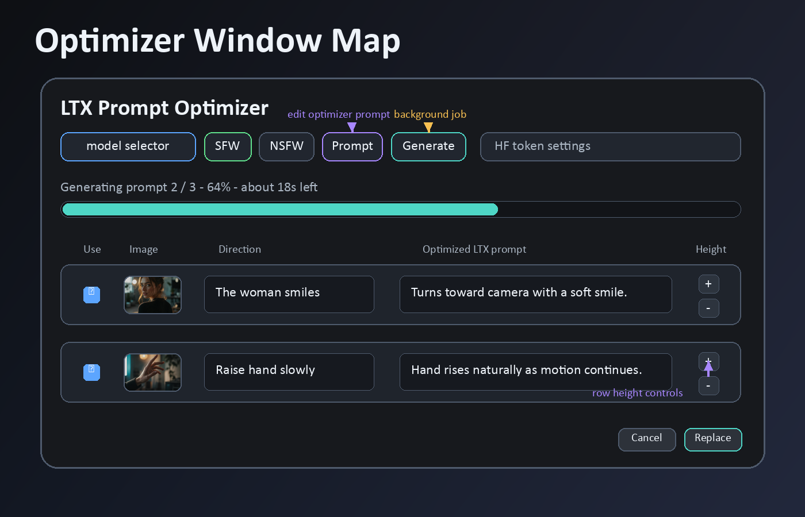
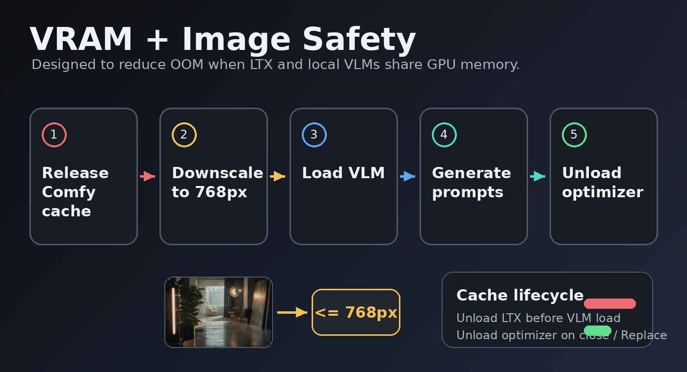

# Overview

This will be a collection of free resources for ComfyUI.

Hopefully it will make creating cool stuff easier.

All of my nodes are created with the help of AI, so there may or may not be redundant, messy code.

## ▶️ YouTube Tutorial Videos

<table>
  <tr>
    <td>
      <p align="center">LTX Director Trailer</p>
      <a href="https://www.youtube.com/watch?v=fZgtkRcu4_k">
        
      </a>
    </td>
    <td>
      <p align="center">LTX Director Tutorial</p>
      <a href="https://www.youtube.com/watch?v=vM60pJJqqEI">
        
      </a>
    </td>
  </tr>
</table>

## ❓ How to install nodes

- Navigate to your `/ComfyUI/custom_nodes/ folder`
- Run `git clone https://github.com/WhatDreamscost/WhatDreamsCost-ComfyUI`
- Or download through the ComfyUI Manager.

### Optional Prompt Optimizer Dependencies

The LTX Director Prompt Optimizer can use local vision-language models. If you want to use it, install the optional dependencies from this repo:

```bash
pip install -r requirements.txt
```

The optimizer can auto-download supported Hugging Face models into your ComfyUI models folder when you press Generate. Some NSFW/unredacted models may require a Hugging Face access token and accepting the model terms on Hugging Face first.

**❗❗IMPORTANT❗❗**

If you don't see the latest version (v1.3.9) yet in the manager, download the nightly version or fetch updates so the manager list refreshes.
You will also need to update ComfyUI-LTXVideo and ComfyUI-KJNodes to their latest versions. This node depends on the latest ComfyUI-LTXVideo updates.

# 🔄 Recent Updates

**v1.3.9**
  * **Fixed recent updates not showing in the manager**

**v1.3.3**
  * **LTX Director Hotfix 2**
    - Fixed duration_seconds input issue.
    - Made both duration widgets visible at all times now.
    - Implemented audio latent fix to improve compatibility.
    - Moved nodes into the WhatDreamsCost category.

**v1.3.2**
  * **LTX Director Hotfix**
    - Fixed epsilon input overlapping custom_width input.
    - Fixed invisible widgets in nodes 2.0 when toggling widget visibility through the settings menu.

  * **LTX Director Prompt Optimizer**
    - Added a new local prompt optimizer window to LTX Director.
    - Uses timeline images in order to generate LTX/Prompt Relay style per-segment prompts.
    - Supports SFW and NSFW/unredacted prompt modes.
    - Lets you write a direction for each image, such as `The woman smiles`, then generates a more polished motion prompt from that.
    - Existing Director prompts are prefilled, and each segment has a checkbox so you can choose what gets optimized.
    - Replace updates only the checked prompts in the Director node; Cancel closes without changing prompts.
    - Supports local model aliases including Qwen3-VL, Qwen2.5-VL, Florence 2, and a fallback text backend.
    - Models auto-download when missing. Hugging Face token support is included for gated/private models.
    - Added clearer Generate status messages, background job polling, and a learned progress bar that estimates prompt generation time based on your hardware/model history.
    - Added VRAM preflight cleanup before loading optimizer models to reduce OOM risk after running LTX generation.
    - Backend image inputs are downscaled to 768px max side before VLM inference to help avoid OOM with 2K+ images.
    - Optimizer models unload when the window closes, when Replace/Cancel is pressed, or when switching models.
    - Prompt generation is now motion-only: it uses images as references for action, expression, camera movement, continuity, and implied sound instead of describing static image details.
    - Previous and next timeline segments are used for natural motion continuity unless the current direction says `cut scene`, `hard cut`, `new scene`, or `transition`.
    - The optimizer UI now has aligned rows, centered thumbnails, row height controls, and does not close from accidental mouse movement while editing.

  * **LTX Director UI and Privacy Updates**
    - Added sorting to the timeline image browser: newest, oldest, name A-Z, and name Z-A.
    - Fixed the initial hidden-image state after refresh.
    - Thumbnail cache now has encrypted private thumbnails when privacy mode is enabled, and private cache files are cleared when toggling privacy.

**v1.3.1**
  * **LTX Director Example Workflow Fix**
    - Minor fix to the example workflow (i forgot to set the clip loader type to ltxv lol)
    
 **v1.3.0**
  * **New nodes: LTX Director and LTX Director Guide**
    - A complete timeline editor that can do almost everything. It's my most ambitious node so far and the successor to LTX Sequencer/Multi Image Loader.

 **v1.2.9**
  * **Fixed every known issue with Multi Image Loader and added text output to Speech Length Calculator**
  
    - Removed the completely useless drag and drop animations (now it's snappy and no longer finicky)
    - Fixed the node resizing on nodes 2.0 
    - Updated grid logic to fit images better
    - Added ablity to right click images to copy/open/save images
    - Fixed the "invisible hitbox" underneath node issue (actually this time).

  Also added a text output to the Speech Length Calculator node (can't believe i didn't do this initially)

<details>
  <summary>Click to view older Updates</summary>

 **v1.2.8**
  * **Updated Load Video UI and Color Conversion**
    * Added crop mode, a simple interface to crop videos. It also include various aspect ratio presets.
    * Updated color conversion to ensure colors are as accurate as possible. Will first check metadata for colorspace, and if metadata is missing then it will guess the colorspace based on video dimensions.
    * Updated display mode toggle UI to be more understandable 

 **v1.2.7**
  * **New Node: Load Video UI**

Custom Node to Trim, Resize, and Preview Videos in Realtime
  
   **v1.2.6**
  * **Updated Speech Length Calculator UI**

Also added duration output to the Load Audio UI node

 **v1.2.5**
  * **Updated Load Audio UI Node**
    * Added Duration Setting
    * Made the whole selection bar draggable
    * Fixed Trimmed UI to show centiseconds
    
 **v1.2.4**
 * **New Node: Load Audio UI**

Overhaul of the load audio node. Features a simple interface to easily trim audio. Also allows dragging and dropping files (fixes the original node that doesn't allow dropping in videos). Also compatible with nodes 2.0.

 **v1.2.3**
  * **Workflow Update + Minor Bug Fix** 
    * Added new workflow that is compatible with the latest ComfyUI version (as of 4/27/26). The new workflow also included an option to include custom audio, and has minor improvements of the previous workflows.
    * Fixed minor bug with Multi Image Loader that blocked mouse input in a small area under the node 🤷‍♂️

**v1.2.0**
  * **New Node: Speech Length Calculator** 
  
  Automatically output in realtime how long a video should be based on the dialouge. 

**v1.1.0**
  * Added resize_method to the Multi Image Loader node for more resize options
  * Added insert_mode which allows you to enter in seconds instead of frames on the LTX Sequencer node
  * Updated workflows with more notes
  * Re-added tiny vae to workflows
  * Fixed various bugs
  * more things i can't rememeber
  
**This update will change the node layouts, so be sure to update your workflows or else they won't work properly.**

❗❗❗ **New Tutorial on using these nodes available: https://www.youtube.com/watch?v=aXDIr8eNovI**  ❗❗❗
</details>

# ⚙️ Custom Nodes


## LTX Director


A Complete Timeline Editor For LTX 2.3. This is the sucessor of my previous nodes, and has loads of features in it. It was originally based off of [Kijai's Prompt Relay node](https://github.com/kijai/ComfyUI-PromptRelay) and my LTX Sequencer/Multi Image Loader nodes.



**Main Features:**
- **Fully Functional Timeline Editor:** I spent hours studying various video editors and ended up with this design. If anyone has ideas for improvements let me know! I will adding documentation on all the functions soon.
- **Prompt Relay integrated:** This unlocks the ability to have granular control over video generation. For more information on Prompt Relay go here, https://gordonchen19.github.io/Prompt-Relay/
- **Prompt Optimizer:** Generate LTX/Prompt Relay friendly motion prompts from your timeline images, text directions, and segment order. Includes SFW/NSFW modes, local VLM support, Hugging Face token support, learned progress estimates, and Replace/Cancel workflow.
- **First, Middle, Last Frame Support:** This has by far the easiest method of creating first/last frames videos. It supports any number of keyframes, and will be the successor of my previous nodes.
- **Custom Audio Support:** Import, trim, and combine your own audio clips in this node. Enabling custom audio is as simple as clicking 1 button. It is also compatible with every other feature in the node, include first/last frames, t2v, i2v, and prompt relay.
- **Image to Video:** Part of the goal of this node was to make it easier to do everything, including Image to Video. It has built in resize functionality, and of course all the benifits of the prompt relay and custom audio integration.
- **Text to Video:** Use text segments to create T2V videos. Compatible with all other features of the node.
- **Privacy Mode Improvements:** Timeline image thumbnails can be hidden in the UI, and private thumbnail cache files are encrypted when privacy mode is enabled.

Download workflows here: https://github.com/WhatDreamsCost/WhatDreamsCost-ComfyUI/tree/main/example_workflows

**Tutorial videos and documentation coming soon**

### LTX Director Prompt Optimizer



The Prompt Optimizer is opened from the icon in the LTX Director toolbar. It shows the Director timeline in segment order with:

- a checkbox for whether that segment should be optimized
- a thumbnail or text placeholder
- the current prompt/direction text
- the generated optimized LTX prompt
- row height controls so both text boxes resize together
- a Prompt button for editing or resetting the optimizer instruction template



It supports both image and text timeline sections. Text sections can use neighboring images and prompts as continuity context, while image sections use the current image as the main motion reference.

It is designed for LTX Prompt Relay style prompting. Instead of writing long image captions, it focuses on the motion that should happen during each segment:

- actions and gestures
- expression changes
- camera movement
- temporal continuation from the previous/next segment
- visible or implied sound cues

Static image details like clothing, lighting, background, or object appearance are avoided unless you explicitly ask for them or a tiny actor reference is needed for clarity. If the segment direction contains cut wording like `cut scene`, `hard cut`, `new scene`, or `transition`, the optimizer treats it as a new shot instead of trying to blend from neighboring segments.

You can type short helping directions per segment, for example:

```text
The woman smiles and turns toward camera
```

If a direction is empty, the selected model uses the image and timeline context to suggest motion for that segment.

Supported local model aliases:

- `qwen3_vl_8b_quality`
- `qwen3_vl_4b_fast`
- `qwen3_vl_4b_unredacted`
- `qwen3_vl_8b_nsfw_caption`
- `qwen2_5_vl_7b_abliterated_legacy`
- `florence2_fast_caption`
- `fallback_text_backend`

The fallback backend is text-only and does not understand images. Qwen-style backends can use previous/current/next images for continuity, while Florence uses the current image plus text context.

The SFW/NSFW toggle changes the prompt instructions:

- SFW asks for cinematic, non-explicit motion prompts.
- NSFW asks for NSFW/unredacted wording and allows explicit adult visual language only when adult content is visible.

The toggle does not switch models by itself. For stronger unredacted behavior, select an unredacted/NSFW model alias as well as NSFW mode.

Models are downloaded into your ComfyUI models folder when needed:

- Qwen/Qwen2.5 models go under `models/VLM`
- Florence goes under `models/LLM`

If a model is gated/private, add a Hugging Face access token inside the optimizer window. The token and optional custom optimizer prompt template are stored locally in:

```text
config/ltx_prompt_optimizer_settings.json
```

Prompt timing estimates are also stored locally, separate from workflows:

```text
config/ltx_prompt_optimizer_timing.json
```



To reduce OOM errors, the optimizer releases Comfy's loaded model cache before loading a VLM and downscales optimizer image inputs to 768px max side before inference. This may make the next LTX generation reload its model, but it should be much safer on limited VRAM.

Editable optimizer prompt templates can use placeholders like `{rating}`, `{direction}`, `{continuity}`, `{segment_type}`, `{visual_context}`, and `{text_segment_instruction}`.

### LTX Director Identity Anchors

The identity anchor nodes are optional helper nodes for improving character or face consistency in LTX Director workflows. They are self-contained in this repo and do not require installing 10S Nodes separately.

You can find them in ComfyUI under `LTXVCustom/Identity`:
- `LTX Director Apply Identity Anchor`
- `LTX Identity Anchor: Face`
- `LTX Identity Anchor: Latent Aware`
- `LTX Identity Anchor: Combine`

`LTX Director Apply Identity Anchor` goes on the model line between LTX Director and your sampler:

```text
LTX Director.model
  -> LTX Director Apply Identity Anchor.model
  -> sampler.model
```

Then connect one identity config node to `LTX Director Apply Identity Anchor.identity_anchor`.

For the simplest face-consistency setup:

```text
LTX Identity Anchor: Face.identity_anchor
  -> LTX Director Apply Identity Anchor.identity_anchor
```

Recommended starting settings:

```text
face_bbox_norm = 0.35,0.10,0.65,0.50
strength = 0.10
inject_mode = tracked
anchor_frame = 0
anchor_upsample = 2
spatial_prior = 0.50
```

`face_bbox_norm` is a normalized rectangle around the face in the anchor frame: `x1,y1,x2,y2`, where `0,0` is top-left and `1,1` is bottom-right.

For latent-aware identity anchoring:

```text
LTX Identity Anchor: Latent Aware.identity_anchor
  -> LTX Director Apply Identity Anchor.identity_anchor
```

Recommended starting settings:

```text
energy_source = auto
strength = 0.10
cache_at_step = 6
similarity_threshold = 0.50
energy_threshold = 0.30
```

Optional extra inputs on `LTX Director Apply Identity Anchor`:
- `guide_data`: connect `LTX Director.guide_data` if Latent Aware should use the first Director guide image as its reference.
- `vae`: connect your LTX VAE when using a reference image or first guide image for Latent Aware energy.
- `sigmas`: connect a scheduler `SIGMAS` output if your workflow exposes one. If not, leave it empty.

To use Face and Latent Aware together:

```text
LTX Identity Anchor: Latent Aware.identity_anchor
  -> LTX Identity Anchor: Combine.anchor_a

LTX Identity Anchor: Face.identity_anchor
  -> LTX Identity Anchor: Combine.anchor_b

LTX Identity Anchor: Combine.identity_anchor
  -> LTX Director Apply Identity Anchor.identity_anchor
```

Leave `scale_strengths` enabled at first. This reduces both strengths slightly so the video does not become too stiff.

### LTX Director Tiled Upscale Guide

`LTX Director Tiled Upscale Guide` is an optional phase-two helper for LTX upscale workflows. It vendors the 10S tiled latent upsampler behavior, runs the latent upscale, then reapplies `LTX Director.guide_data` at the upscaled latent size.

Recommended two-pass wiring:

```text
Phase 1 sampled video_latent
  -> LTXVCropGuides
  -> LTX Director Tiled Upscale Guide.latent

LatentUpscaleModelLoader.LATENT_UPSCALE_MODEL
  -> LTX Director Tiled Upscale Guide.upscale_model

LTX Director.guide_data
  -> LTX Director Tiled Upscale Guide.guide_data

LTX Director Tiled Upscale Guide.latent
  -> LTXVConcatAVLatent
  -> light phase-two sampler
```

Use `LTX Director Tiled Upscale Settings` to adjust tiling:

```text
tile_size = 24
overlap = 8
max_size_for_no_tile = 32
rotate_for_landscape = false
debug = false
```

This node makes the upscale/guide order harder to wire incorrectly. If your main issue is color or prompt drift after upscaling, still use a light second sampler pass after this node; a tiled sampler is recommended when available.


## Multi Image Loader


An Image loader that features a built in gallery, allowing your to easily rearrange images and output them seperately or batched together. It also combines the image resize node and LTXVPreprocess node to reduce clutter in LTX workflows.

## LTX Sequencer


An overhaul of the LTXVAddGuideMulti node. It allows you to quickly create FFLF (First Frame Last Frame) videos, shot sequences, supports any number of middle frames.

Connect the Multi Image Loader node's multi_output to automatically update the node's widgets.

It also has a sync feature that syncs all LTX Sequencer nodes together in realtime, removing the need to edit every single node manually every time you want to make a change to something. 


## LTX Keyframer


An overhaul of the LTXVImgToVideoInplaceKJ node. It allows you to quickly create FFLF (First Frame Last Frame) videos and shot sequences. Also upports any number of middle frames.

Connect the Multi Image Loader node's multi_output to automatically update the node's widgets.

It also has a sync feature that syncs all LTX Keyframer nodes together in realtime, removing the need to edit every single node manually every time you want to make a change to something. 

**I would recommend using the LTX Sequencer Node over this node, after further testing it seems superior in at pretty much everything. I'll leave it in just in case more people want to test it**

## Speech Length Calculator

<br>
<br>
This node calculates in realtime how long a video should be based on the dialogue. Any words in quotations will be considered as speech. The node updates in realtime without having to run the workflow, and outputs the length depending on how fast the speech is.

If you connect another string/text node to the text_input, it will still update in the length in realtime.

I kept having to play the guessing game on my own generations so I made this node to make it easier :man_shrugging:

## Load Video UI  
<table width="100%">
  <tr>
    <td width="50%" align="center">
      <p>Simple Controls</p>
      
    </td>
    <td width="50%" align="center">
      <p>New Crop Mode!</p>
      
    </td>
  </tr>
</table>

<br>
<br>
An upgraded Load Video node. It has the following features:

* Simple interface to quickly trim videos and preview them in realtime.
* Ability to load any length of video into the node (the default load video node was limited to 100MB files)
* Easily switch between showing seconds and frames with a toggle button. This will change the widgets as well as the interface.
* Multiple options for resizing the video (maintain aspect ratio, crop, stretch to fit, pad)
* Allows dragging and dropping files into the node
* Progress bar
* Optimized to use less RAM (still very limited due to ComfyUI limitations, but at least a little more efficient)

Please note that due to ComfyUI limitations (and the fact that this node doesn't use any addtional libraries), this node will not work well for outputting large videos. You can trim any length of video without a problem, but if the output is still large it will end up using a lot of RAM. I have implemented various optimizations though to make it use less memory.

## Load Audio UI  

<br>
<br>
An upgraded Load Audio node. Features a simple interface to easily trim audio. Also allows dragging and dropping files (fixes the original node that doesn't allow dropping in videos). Also compatible with nodes 2.0.

# 💡 Workflows

<br>
<br>
This is a compact LTX 2.3 workflow for I2V and First Frame, Middle Frame, Last frame video generation.
I seperated and organized everything into subraphs to make things as clean as possible, and added toggles to customize the workflow quickly.

Download workflows here: https://github.com/WhatDreamsCost/WhatDreamsCost-ComfyUI/tree/main/example_workflows

Or drag and drop the image into ComfyUI to import workflow.

# ❗ Known Issues

Fixed everything so far. If there are any other issue or bugs you find please let me know!

# 💡 Additional Info

I made these nodes knowing almost nothing about python and a beginner level knowledge of javascript. Feel free to suggest improvements, and if you run into any bugs let me know.

For those asking, I mainly used gemini to create these nodes.
